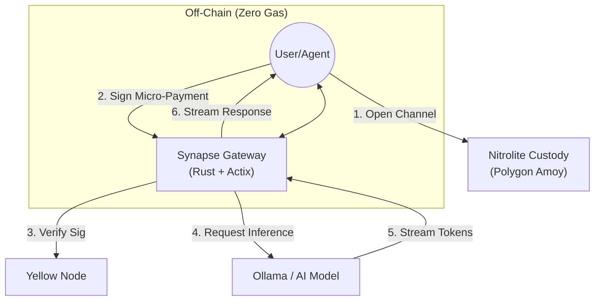

# 🧠 Synapse: The Neural Economy Protocol

[](https://opensource.org/licenses/MIT)
[](https://polygon.technology/)
[](https://www.yellow.org/)
[](https://www.rust-lang.org/)

> **"Streaming money as fast as data."**

---

## 🔮 The Vision: A Financial Layer for Autonomous Agents

**Synapse** is not just a chat application; it is the blueprint for the **Agentic Economy**.

We are building the **Synapse Infra SDK**—a universal adapter that allows any AI agent, API, or digital service to accept **real-time, gasless micro-payments**.

### Why This Matters?

We are moving towards a world of billions of autonomous agents. These agents will need to trade resources (compute, storage, data) with each other in milliseconds.

- **Credit cards don't work for software.**
- **Blockchains are too slow for real-time interaction.**
- **Gas fees kill micro-transactions.**

**Synapse is the solution.** By leveraging **Yellow Network's State Channels**, we enable agents to open a direct financial "socket" to each other, streaming value frame-by-frame, token-by-token.

---

## ⚡ The Showcase: "Pay-As-You-Go" AI Assistant

To demonstrate the power of this protocol, we have built the **Synapse Chat App**—a fully functional reference implementation.

In this demo, users pay for AI inference **per token generated**.

- **0.001 USDC** buys you **100 tokens**.
- Payment happens **instantly** as the text appears on the screen.
- **Zero Gas** after the initial channel open.

---

## 🛑 The Core Problem

AI Agents are evolving rapidly, but they remain "economically paralyzed":

1.  **Latency Mismatch:** An AI Agent "thinks" in milliseconds, but blockchains settle in seconds. An agent cannot wait 12 seconds for an Ethereum block to pay $0.001 for a search query.
2.  **Gas Friction:** It is economically impossible to pay $0.50 in gas to settle a $0.01 micro-payment.
3.  **Subscription Fatigue:** Autonomous agents cannot manage 50 different monthly SaaS subscriptions. They need a **Pay-As-You-Go** protocol.

## ✅ The Solution: State Channels

**Synapse** acts as a state-channel gateway. It combines:

- **Yellow Network's Nitrolite Protocol**: For off-chain, high-frequency settlement.
- **Rig-Core / Rust Backend**: For high-performance, safe AI orchestration.
- **Polygon Amoy**: For secure on-chain custody.

---

## 🏗️ Architecture

The system enables a **Machine-to-Machine (M2M)** economy where payments are settled instantly off-chain and only finalized on-chain when necessary.



---

## 🚀 Use Cases for the Synapse SDK

While our demo focuses on Chat, the **Synapse SDK** will power:

1.  **Agent-to-Agent Markets:** An Agent paying another Agent to perform a web search or execute a complex task.
2.  **API Monetization:** Developers charging $0.0001 per API call instead of $20/month.
3.  **Content Streaming:** Pay-per-second video or pay-per-paragraph reading.
4.  **IoT Micropayments:** Sensor networks selling data streams in real-time.

---

## 💻 Tech Stack

- **Frontend:** React, Vite, TailwindCSS (The User Interface)
- **Settlement:** Yellow Network Nitrolite SDK
- **Backend:** Rust (Actix-web), SQLx (High-Performance Orchestration)
- **Database:** PostgreSQL (Ledger & History)
- **AI Engine:** Ollama (Local LLM Inference)
- **Blockchain:** Polygon Amoy Testnet

---

## 🛠️ Quick Start Guide

Want to run the reference implementation?

### Prerequisites

- **Node.js** 18+ & **Rust** 1.70+
- **PostgreSQL** 14+
- **Ollama** (running `gemma3:1b` or similar)
- **Wallet** with generic Polygon Amoy USDC

### 1. Backend Setup

```bash
# Create DB
createdb synapse

# Setup Environment
cd backend
cp .env.example .env # Update with your credentials

# Run Migrations & Start
cargo install sqlx-cli
sqlx migrate run
cargo run
```

### 2. Frontend Setup

```bash
cd frontend
npm install
npm run dev
```

The app will launch at `http://localhost:5173`. Connect your wallet, initialize the channel, and experience the future of payment streaming.
